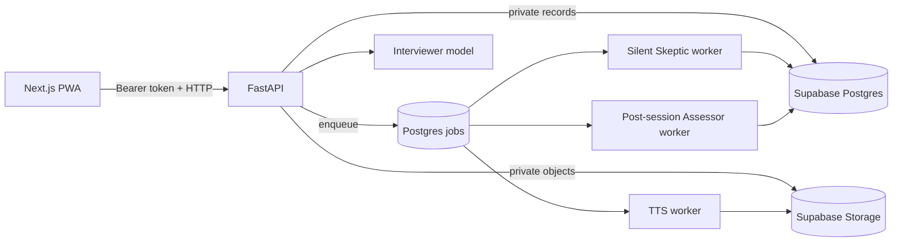
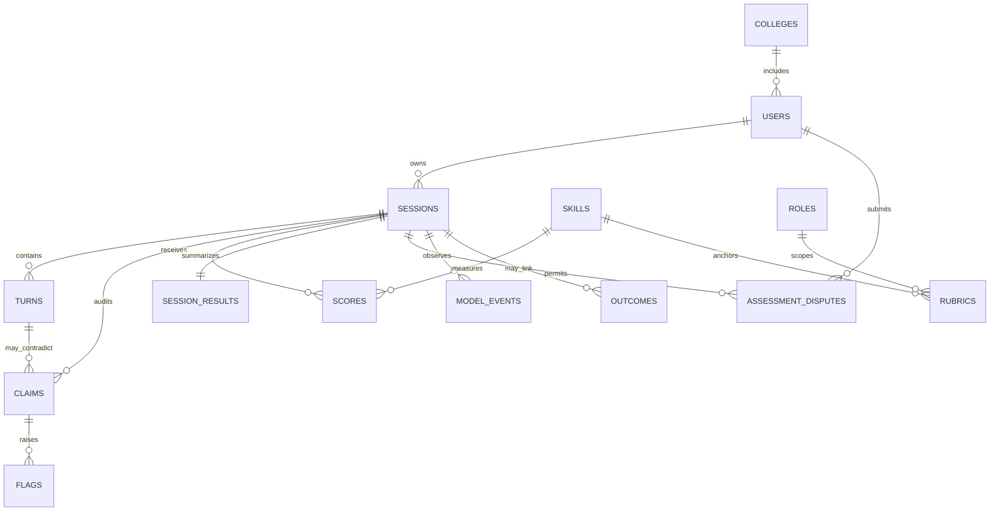

# Mirror architecture

## Repository

```text
apps/
  web/                 Next.js candidate experience and Supabase browser auth boundary
  api/                 FastAPI orchestration, validation, session APIs
packages/
  prompts/             Versioned and logically isolated agent prompts
  schemas/             Shared TypeScript contracts
  evaluation/          Synthetic persona manifests and future golden harness
workers/
  skeptic/             Silent per-answer analysis worker (Stage 3)
  assessor/            Post-session assessment worker (Stage 4)
  tts/                 Planned-question cache and adaptive TTS worker (Stage 2)
supabase/
  migrations/          PostgreSQL types, constraints, indexes, RLS
  seed/                Unmistakably synthetic development fixtures
tests/
  unit/                Deterministic invariants
  integration/         Turn-loop boundaries
  personas/            P1-P7 regression expectations
  golden/              Versioned synthetic and expert-labelled cases
docs/                  Architecture, scoring, privacy, and data governance
```

## Runtime boundaries



The Interviewer sees the question plan, session timing, recent turns, and eligible flags. It never sees scoring rubrics or Assessor output. The Skeptic is silent and runs after every candidate answer. The Assessor runs only after completion with temperature zero and strict structured output.

The phase controller is code, not an LLM. Selection priority is eligible high-value flag, depth probe, ladder-up, planned question, transition, then closing. Each question thread permits at most two probes.

## Entity relationship model



Every user-owned table has RLS. Candidates can only read their own rows. TPO users have no policy granting individual transcript, recording, claim, or score access. Worker-only tables are service-role-only.

## Turn transaction contract

`POST /api/sessions/{id}/turn` is reserved for Stage 2 and accepts `multipart/form-data`:

| Field | Type | Rule |
|---|---|---|
| `audio` | Blob | WebM, OGG, MP4, or WAV; bounded size |
| `metadata` | JSON `TurnRequestMetadata` | Includes idempotent `client_turn_id`, duration, silence, content type |

Successful response is `TurnResponse`:

```json
{
  "question_text": "Earlier you described the backend as something you built. What parts did you personally implement?",
  "audio_url": "https://signed-private-url.example/question.ogg",
  "turn_index": 8,
  "phase": "PROJECTS",
  "turn_type": "contradiction_probe"
}
```

The server persists the candidate turn and enqueues `skeptic_turn` in one transaction. It then reads only flags where `detected_at_turn < current_turn AND consumed = false`; shadow-mode flags are excluded. Skeptic failure never blocks the response. Blank STT output returns a retryable error without calling the Interviewer. TTS failure returns question text and a null audio URL.

## Deployment modes

- Development without credentials: fixed local candidate plus process-local repository.
- Development/production with credentials: Supabase Auth validation and PostgREST persistence.
- Production refuses to use the local identity when authentication is not configured.


