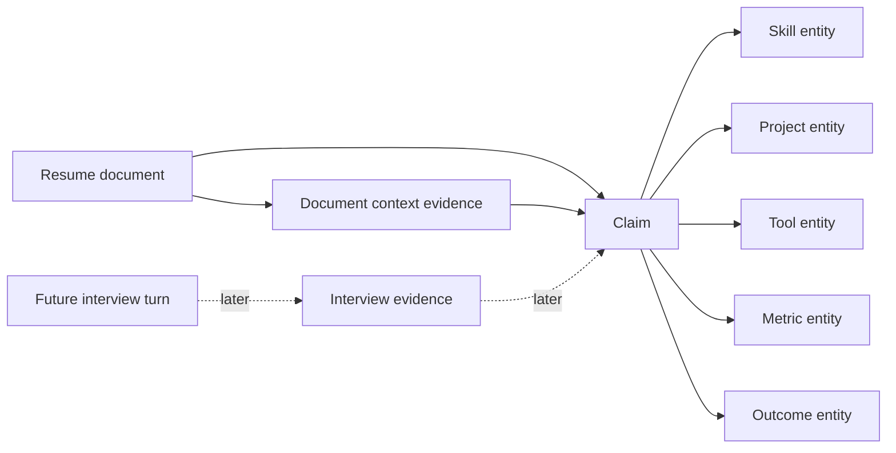
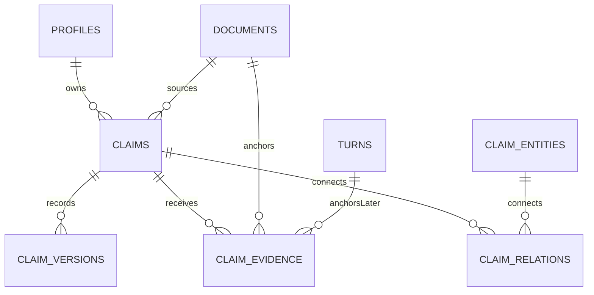

# Claims Graph

The Claims Graph is Mirror's central, auditable record of what a candidate has stated, where that statement originated, and which evidence later relates to it. It is implemented with deterministic application logic and PostgreSQL. No AI agent owns or mutates the graph directly.

## Information flow

Resume analysis inserts claims as `UNVERIFIED`. That status is neutral: it means no later evidence evaluation has occurred. A high verification priority means a claim is useful to discuss in an interview, not that it is suspicious.

## Data model

- `claims` is the stable statement ledger. It records owner, optional session and source document, normalized type/source/status, confidence, verification priority, synthetic marker, and timestamps.
- `claim_entities` deduplicates user-owned skills, projects, tools, companies, metrics, outcomes, and responsibilities by a case-insensitive canonical name. JSON metadata holds type-specific structured values without weakening the stable columns.
- `claim_relations` stores typed, directed edges between claims and entities (or between two claims). Database triggers require both nodes to belong to the relation owner.
- `claim_versions` is an append-only audit history. Initial creation, user corrections, and status evolution record previous and new state, actor, reason, and monotonically increasing version.
- `claim_evidence` links real documents, future transcript turns, user corrections, or system observations to a claim. Evidence direction is `SUPPORTS`, `WEAKENS`, or `CONTEXT_ONLY`; strength is bounded from zero to one.

## Application boundary

`ClaimsGraphService` is the only application-facing mutation boundary. It provides ownership-scoped claim lookup, user/session/skill/project queries, related-claim discovery, claim and relation creation, version creation, status updates, and evidence linking. Repository implementations remain private infrastructure; AI agents are not given repository or SQL access.

The HTTP API is intentionally read-only:

- `GET /api/v1/claims` lists the authenticated user's claims. Optional filters are `skill`, `project`, `status`, and `source`.
- `GET /api/v1/claims/{claim_id}` returns one claim with its entities, relations, versions, evidence, and related claims.

Authentication supplies the user ID. Requests cannot select another user by sending a `user_id` parameter. Service-role credentials remain backend-only, while RLS independently limits authenticated database reads to `auth.uid()`.

## Resume-analysis integration

Resume completion and graph construction share one PostgreSQL transaction. Structured resume fields deterministically create canonical entities and typed edges, an initial AI-authored claim version, and document-context evidence. Candidate corrections append a user-authored version and preserve the original extraction. No synthetic interview evidence is created.

## Why PostgreSQL is sufficient

The current graph is ownership-partitioned and shallow: claims connect mostly to a small set of typed entities and evidence anchors. Indexed joins, common table expressions, JSONB metadata, constraints, transactions, and RLS provide the required traversal and security behavior without a second database. PostgreSQL also keeps resume completion, graph creation, and audit history atomic. A graph database should only be reconsidered if measured workloads require deep, variable-length traversal that PostgreSQL cannot meet—not because the domain uses graph terminology.

